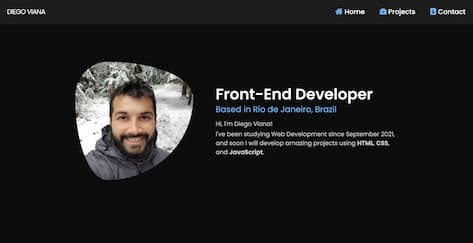

# 🌱 My Personal Portfolio

###  This Portfolio is my first project, created to show my projects during my learning journey in Web Development.

---

[See the Project Here](https://diegovianaf.github.io/portfolio/)

---

## 📍 Sections
### The site has 3 different sections:

- **Home:** a simple page with my profile picture and a brief introduction

- **Portfolio:** to show my projects that will be developed

- **Contact:** with details on how you can get in touch with me
<!-- - **About:** -->
---

## 🔓 Languages
### For the development of this site I used the following languages:

- HTML
- Sass

---

## 👨‍💻 Author
### [Diego Viana](https://diegovianaf.github.io/portfolio/)
